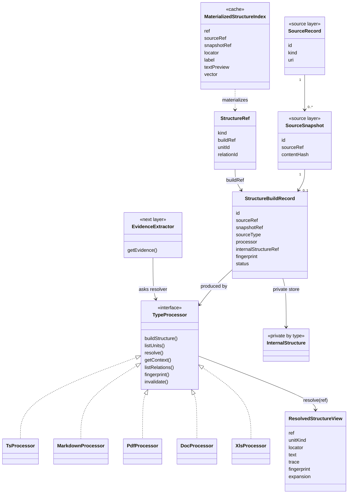

# 01 Structure Layer

本文件重构结构层设计。

核心结论：

```txt
结构层不是一套统一节点表。

结构层 = 类型处理器的结构解析能力 + 对外标准结构访问协议。
```

也就是说：

```txt
TS 可以用 Tree-sitter。
Markdown 可以用 Markdown AST。
PDF 可以用 Layout/OCR。
DOC 可以用 DOC 结构解析。
XLS 可以用 Sheet/Table 解析。

它们内部图、节点字段、边类型、粒度策略都可以不同。

但对外必须提供同一组能力：
  可引用
  可追溯
  可失效
  可展开
```

## 处理矩阵

横轴是资料类型，纵轴是逻辑层。

单元格表示该类型在该层的内部实现方式。

| 分类 / 类型 | TS | MD | PDF | DOC | XLS |
|---|---|---|---|---|---|
| 清单层 | 通用 | 通用 | 通用 | 通用 | 通用 |
| 结构层 | Tree-sitter 实现 | Markdown AST 实现 | Layout/OCR 实现 | DOC 结构实现 | Sheet/Table 实现 |
| 证据层 | Code evidence | MD evidence | PDF evidence | DOC evidence | Table evidence |
| 事实层 | Code facts | Rule facts | Doc facts | Doc facts | Table facts |
| Scope 信号入口 | Path/package | Title/path | Cover/meta | Cover/meta | Sheet/header |

这张表说明：

```txt
清单层是通用的。
结构、证据、事实的内部生成逻辑按类型实现。
Scope 层本身是标准图层；表格里这一行只表示各类型能给 ScopeAssignment 提供什么局部信号。
后续层只依赖每层暴露的标准能力接口。
```

本文件只设计结构层，但它必须知道自己会被证据层、事实层和 Scope 层调用。

## 横向标准原则

横向标准不是统一内部数据字段。

横向标准是统一能力协议。

```txt
内部多态。
外部协议统一。
```

不同类型的内部结构可以完全不同：

```txt
TS:
  Tree-sitter AST、符号表、调用解析、条件片段。

Markdown:
  Markdown AST、标题树、段落、表格、代码块。

PDF:
  页、文本块、OCR 结果、bbox、版面区域。

DOC:
  段落、标题、表格、批注、样式、页内位置。

XLS:
  workbook、sheet、table、row、column、cell range。
```

但每个对外结果都必须具备：

```txt
引用:
  能被标准 Ref 引用。

追溯:
  能追到 source、snapshot、结构位置和生成方法。

失效:
  能说明依赖什么，资料或解析器变化后能判断是否 stale。

展开:
  能继续展开原文、邻近结构、子结构、内部关系。
```

## 结构层回答什么

结构层只回答：

```txt
这份资料内部是什么结构？
哪些结构单元可以作为后续层引用对象？
这些位置在哪里？
这些位置周围有什么上下文？
这些内部关系是解析器直接看得见的吗？
结构解析结果是否仍然有效？
```

结构层不回答：

```txt
这条内容是不是事实？
这条内容属于哪个系统、团队、业务线？
这段代码实现了哪个业务能力？
这个接口和哪个文档规则是否一致？
两个仓库里的同名函数是不是同一个业务概念？
```

这些问题属于证据层、事实层、Scope 层和语义层。

## 结构层产物

结构层不再定义统一的 `StructureNode` 或统一的 `StructureEdge`。

它只定义少量横向契约。

```txt
StructureBuildRecord
  某个 SourceSnapshot 的结构构建记录。

InternalStructure
  类型处理器私有的内部结构图。

StructureRef
  对外引用某个结构单元或内部关系的地址。

ResolvedStructureView
  通过接口解析出来的结构视图。

StructureResolver
  标准访问接口。

MaterializedStructureIndex
  查询缓存和加速索引，不是 canonical schema。
```

## StructureBuildRecord

`StructureBuildRecord` 是一次结构构建的最小记录。

它绑定：

```txt
SourceSnapshot
Processor
内部结构存储位置
整体指纹
解析状态
```

示例：

```json
{
  "id": "structureBuild:snapshot:doc:refund-rules:sha256-demo",
  "recordType": "StructureBuildRecord",
  "sourceRef": "source:doc:refund-rules",
  "snapshotRef": "snapshot:doc:refund-rules:sha256-demo",
  "sourceType": "md",
  "processor": {
    "name": "MarkdownProcessor",
    "version": "0.1.0",
    "configHash": "sha256:processor-config-demo"
  },
  "internalStructureRef": "internal:md:refund-rules:sha256-demo",
  "fingerprint": "sha256:structure-build-demo",
  "status": "parsed"
}
```

字段解释：

| 字段 | 含义 | 说明 |
|---|---|---|
| `id` | 构建记录 ID | 一次 SourceSnapshot 结构构建一个记录。 |
| `recordType` | 记录类型 | 固定为 `StructureBuildRecord`。 |
| `sourceRef` | 来源资料 | 指向 SourceRecord。 |
| `snapshotRef` | 内容版本 | 指向 SourceSnapshot。 |
| `sourceType` | 资料类型 | ts、md、pdf、doc、xls 等。 |
| `processor` | 类型处理器 | 解析器版本和配置必须进入增量判断。 |
| `internalStructureRef` | 内部结构引用 | 指向类型处理器私有存储。 |
| `fingerprint` | 结构整体指纹 | 用于判断整体结构是否变化。 |
| `status` | 构建状态 | parsed、partial、failed、skipped、stale。 |

`StructureBuildRecord` 是结构层的上下文根。

后续接口通过它找到具体类型处理器和内部结构实现。

## InternalStructure

`InternalStructure` 是类型处理器私有结构。

它不是横向标准对象。

不同资料类型可以完全不同。

例子：

```txt
TsInternalStructure:
  Tree-sitter AST cache
  symbols
  calls
  conditions
  throws
  imports
  resolver diagnostics

MarkdownInternalStructure:
  document
  headings
  sections
  paragraphs
  tables
  code blocks

PdfInternalStructure:
  pages
  text blocks
  OCR blocks
  table regions
  page bbox

DocInternalStructure:
  sections
  paragraphs
  tables
  comments
  styles

XlsInternalStructure:
  workbook
  sheets
  tables
  rows
  columns
  cell ranges
```

要求只有一个：

```txt
必须能被该类型的 StructureResolver 解析。
```

不要求所有 InternalStructure 使用同样字段。

## StructureRef

`StructureRef` 是结构层对外的标准引用。

它引用的是：

```txt
某次结构构建中的某个结构单元。
或某次结构构建中的某条内部关系。
```

建议两种形态：

```json
{
  "kind": "unit",
  "buildRef": "structureBuild:snapshot:doc:refund-rules:sha256-demo",
  "unitId": "md:p:amount-limit"
}
```

```json
{
  "kind": "relation",
  "buildRef": "structureBuild:snapshot:code:refund-service:sha256-demo",
  "relationId": "ts:call:refundOrder->calculateRefundableAmount"
}
```

字段解释：

| 字段 | 含义 | 说明 |
|---|---|---|
| `kind` | 引用对象类型 | unit 或 relation。 |
| `buildRef` | 结构构建记录 | 指向 StructureBuildRecord。 |
| `unitId` | 结构单元 ID | 只在 kind=unit 时存在。 |
| `relationId` | 内部关系 ID | 只在 kind=relation 时存在。 |

`unitId` 和 `relationId` 是 build 内局部 ID。

它们不需要全局唯一，因为 `buildRef` 已经提供了上下文。

## 什么是结构单元

结构单元不是统一节点模型。

它只是：

```txt
该类型处理器愿意暴露给后续层的可引用结构对象。
```

结构单元的粒度由类型处理器决定，但必须遵守一个原则：

```txt
只暴露后续证据、事实、查询或结构关系可能需要的单元。
不要把内部 AST、OCR、表格所有细节全部暴露。
```

建议粒度：

| 类型 | 建议结构单元 | 不建议结构单元 |
|---|---|---|
| TS | file、class、function、method、field、condition、throw、return、external call、route handler | 每个 token、括号、普通 AST 节点 |
| MD | section、paragraph、table、list item、code block | 每个字、每个标点 |
| PDF | page、text block、table region、figure region、OCR block | 每个 OCR 字符 |
| DOC | section、paragraph、table、comment、heading | 样式碎片、普通空段落 |
| XLS | workbook、sheet、table、row、column、cell range、关键 cell | 每个空单元格 |

例如代码：

```ts
if (request.amount > refundableAmount) {
  throw new RefundError("REFUND_AMOUNT_EXCEEDS_BALANCE");
}
```

可以暴露：

```txt
unit: ts:function:refundOrder
unit: ts:condition:amount-gt-refundable
unit: ts:throw:refund-amount-exceeds-balance
```

不需要暴露：

```txt
unit: token:if
unit: token:(
unit: binary-expression-left
```

## StructureResolver

`StructureResolver` 是结构层真正的横向标准。

不同类型 processor 都要实现它。

```txt
listUnits(buildRef, filter)
resolve(ref)
getContext(ref, options)
listRelations(buildRef, filter)
listRelated(ref, filter)
fingerprint(ref)
invalidate(changeSet)
```

接口含义：

| 接口 | 作用 |
|---|---|
| `listUnits` | 列出某次结构构建暴露的结构单元。 |
| `resolve` | 把 StructureRef 解析成可读、可定位的结构视图。 |
| `getContext` | 获取结构单元周围上下文，例如父章节、函数体、邻近段落、所在页。 |
| `listRelations` | 列出解析器直接可见的内部关系。 |
| `listRelated` | 围绕某个入口展开内部关系。 |
| `fingerprint` | 返回入口或关系的当前指纹。 |
| `invalidate` | 根据 SourceSnapshot 或 processor 变化判断失效范围。 |

证据层、事实层和 Scope 层不直接读取内部结构。

它们通过 `StructureResolver` 获取自己需要的内容。

## ResolvedStructureView

`resolve(ref)` 返回的是视图，不是 canonical 内部结构。

视图可以包含冗余字段，因为它是接口结果，不是权威存储。

示例：

```json
{
  "ref": {
    "kind": "unit",
    "buildRef": "structureBuild:snapshot:doc:refund-rules:sha256-demo",
    "unitId": "md:p:amount-limit"
  },
  "unitKind": "markdown_paragraph",
  "label": "退款金额不能超过订单当前可退余额。",
  "locator": {
    "kind": "line_range",
    "uri": "raw/product-refund-rules.md",
    "startLine": 11,
    "endLine": 11,
    "headingPath": ["订单部分退款"]
  },
  "text": "退款金额不能超过订单当前可退余额。",
  "fingerprint": "sha256:demo-paragraph-amount-limit",
  "trace": {
    "sourceRef": "source:doc:refund-rules",
    "snapshotRef": "snapshot:doc:refund-rules:sha256-demo",
    "processor": "MarkdownProcessor@0.1.0"
  },
  "expansion": {
    "available": ["parent", "siblings", "children", "relations", "raw"]
  }
}
```

`ResolvedStructureView` 必须支持：

```txt
引用
追溯
失效
展开
```

但它不是内部结构对象。

## 内部关系

结构层关系只表达解析器直接看得见的内部关系。

关系类型不要求所有文件类型统一。

例如：

```txt
TS:
  declares
  calls
  imports
  reads_field
  writes_field
  throws

MD:
  contains
  precedes
  links_to_heading

PDF:
  contains
  nearby_on_page
  table_contains_cell

DOC:
  contains
  precedes
  comment_on

XLS:
  has_sheet
  has_row
  has_column
  cell_in_row
  formula_refs
```

结构层不能表达：

```txt
实现某能力
验证某规则
约束某流程
属于某系统
两个同名函数是同一个业务概念
```

这些分别进入事实、Scope 或语义层。

## UML 关系图

这张图表达重构后的关系。



## 结构层到证据层

证据层不直接解析 MD、TS、PDF、DOC、XLS 的私有结构。

证据层调用对应类型 processor：

```txt
getEvidence(structureRef, options)
```

或者先调用结构层：

```txt
resolve(structureRef)
getContext(structureRef)
```

然后由类型实现生成证据：

```txt
CodeEvidenceExtractor
MDEvidenceExtractor
PDFEvidenceExtractor
DOCEvidenceExtractor
TableEvidenceExtractor
```

不同 evidence extractor 的内部实现可以不同，但返回给后续层的 `EvidenceRef / EvidenceResolver / ResolvedEvidenceView` 协议应统一。

## 增量更新

结构层增量更新分两级。

### Build 级

缓存键：

```txt
sourceRef
snapshotRef
sourceType
processor.name
processor.version
processor.configHash
```

如果 `SourceSnapshot.contentHash` 没变，且 processor 版本和配置没变：

```txt
结构层可以直接跳过。
```

### Unit / Relation 级

内部结构变化后，类型 processor 自己判断哪些结构单元或关系可复用。

横向要求只需要输出：

```txt
changed refs
stale refs
new refs
unchanged refs
```

不要强制所有类型使用同一种 `stableKey + fingerprint` 算法。

但每个对外 ref 必须能回答：

```txt
fingerprint(ref)
```

这样证据层、事实层、Scope 层可以只重建受影响的局部 ScopeAssignment。

## 类型实现示例

### TS

结构实现：

```txt
Tree-sitter parse
  -> AST cache
  -> symbol extraction
  -> call/import/field access extraction
  -> optional resolver
```

对外结构单元：

```txt
file
class
function
method
field
condition
throw
return
external_call
route_handler
```

对外关系：

```txt
contains
declares
imports
calls
reads_field
writes_field
throws
```

### MD

结构实现：

```txt
Markdown AST
  -> heading tree
  -> sections
  -> paragraphs
  -> tables
  -> code blocks
```

对外结构单元：

```txt
document
section
paragraph
table
list_item
code_block
```

对外关系：

```txt
contains
precedes
links_to_heading
```

### PDF

结构实现：

```txt
layout analysis
OCR
page segmentation
table detection
region detection
```

对外结构单元：

```txt
page
text_block
ocr_block
table_region
figure_region
```

对外关系：

```txt
contains
nearby_on_page
table_contains_cell
```

### DOC

结构实现：

```txt
document structure parser
sections
paragraphs
tables
comments
styles
```

对外结构单元：

```txt
section
paragraph
table
comment
heading
```

对外关系：

```txt
contains
precedes
comment_on
```

### XLS

结构实现：

```txt
workbook parser
sheets
tables
headers
rows
columns
cell ranges
formulas
```

对外结构单元：

```txt
workbook
sheet
table
row
column
cell_range
key_cell
```

对外关系：

```txt
has_sheet
has_row
has_column
cell_in_row
formula_refs
```

## 本层判断边界

可以在结构层判断：

- 这是不是一个标题。
- 这是不是一个段落。
- 这是不是一个函数。
- 这是不是一个 OpenAPI operation。
- 这个函数是否调用另一个函数。
- 这一行表格的 case_id 是什么。
- 这个文本块在 PDF 第几页哪个坐标。

不能在结构层判断：

- `amount` 是否代表退款金额。
- `refundOrder` 是否属于 A 电商平台。
- `refundOrder` 是否实现订单部分退款。
- 某个测试用例是否验证了某条业务规则。
- A 仓库的退款逻辑和 B 仓库的退款逻辑是不是同一套逻辑。
- 文档规则和代码实现是否一致。

结构层的价值是：

```txt
允许每种资料拥有自己的真实解析结构。
用统一接口把这些结构暴露给后续层。
把查询便利性交给缓存和索引，不污染内部实现。
```
